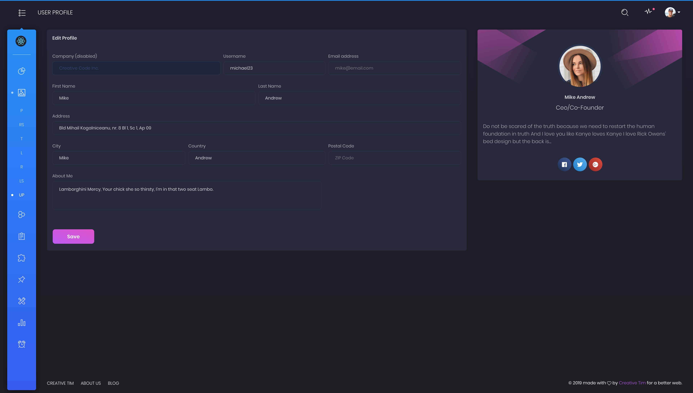
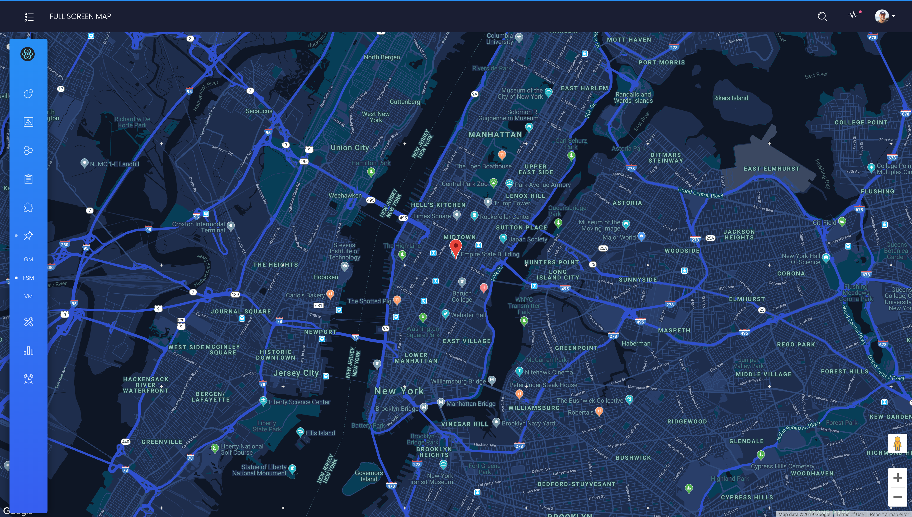

# AgroMonitoring Dashboard 
Based on [Black Dashboard PRO React](https://demos.creative-tim.com/black-dashboard-pro-react/#/admin/dashboard) [](https://twitter.com/intent/tweet?url=https%3A%2F%2Fdemos.creative-tim.com%2Fblack-dashboard-pro-react%2F%23%2Fadmin%2Fdashboard&text=Black%20Dashboard%20PRO%20React%20-%20Premium%20Bootstrap%20Admin%20Template&original_referer=https%3A%2F%2Fdemos.creative-tim.com%2Fblack-dashboard-pro-react%2F&via=creativetim&hashtags=react%2Cbootstrap%2Creactstrap%2Ccreativetim%2Ccreativetimofficial)


## Table of Contents

* [Demo](#demo)
* [Quick Start](#quick-start)
* [Documentation](#documentation)
* [File Structure](#file-structure)


## Demo

| Dashboard | User Profile | Tables | Maps | Notification |
| --- | --- | --- | --- | --- |
| [](https://demos.creative-tim.com/black-dashboard-pro-react/#/admin/dashboard) | [](https://demos.creative-tim.com/black-dashboard-pro-react/#/admin/user-profile) | [](https://demos.creative-tim.com/black-dashboard-pro-react/#/admin/extended-tables) | [](https://demos.creative-tim.com/black-dashboard-pro-react/#/admin/full-screen-map) | [](https://demos.creative-tim.com/black-dashboard-pro-react/#/admin/notifications)

[View More](https://demos.creative-tim.com/black-dashboard-pro-react/#/admin/dashboard).


## Quick start
`npm install`

`npm run`


## Documentation
The documentation for the Black Dashboard PRO React is hosted at the [website](https://demos.creative-tim.com/black-dashboard-pro-react/#/documentation/tutorial).


## File Structure

Within the download you'll find the following directories and files:

```
black-dashboad-pro-react
.
├── CHANGELOG.md
├── README.md
├── package.json
├── Documentation
│   └── documentation.html
├── public
│   └── index.html
└── src
    ├── App.js
    ├── index.js
    ├── reducer.js
    ├── routes.js
    ├── store.js
    ├── logo.svg
    ├── assets
    │   ├── css
    │   ├── demo
    │   ├── fonts
    │   ├── img
    │   └── scss
    │       ├── black-dashboard-pro-react
    │       │   ├── bootstrap
    │       │   │   ├── mixins
    │       │   │   └── utilities
    │       │   ├── custom
    │       │   │   ├── cards
    │       │   │   ├── mixins
    │       │   │   ├── utilities
    │       │   │   └── vendor
    │       │   └── react
    │       │       └── plugins
    │       │── agro-styles.scss
    │       └── black-dashboard-pro-react.scss
    ├── components
    │   ├── CustomUpload
    │   │   └── ImageUpload.jsx
    │   ├── FixedPlugin
    │   │   └── FixedPlugin.jsx
    │   ├── Footer
    │   │   └── Footer.jsx
    │   ├── Navbars
    │   │   ├── AdminNavbar.jsx
    │   │   ├── AuthNavbar.jsx
    │   │   └── RTLNavbar.jsx
    │   ├── Sidebar
    │   │   └── Sidebar.jsx
    │   └── SortingTable
    │       └── SortingTable.jsx
    ├── features (Redux)
    │
    ├── layouts
    │   ├── Admin
    │   │   └── Admin.jsx
    │   ├── Auth
    │   │   └── Auth.jsx
    │   └── RTL
    │       └── RTL.jsx
    ├── services (api)
    ├── variables
    │   ├── charts.jsx
    │   ├── general.jsx
    │   └── icons.jsx
    ├── utils
    └── views
        ├── agro-components
        ├── charts
        ├── components
        │   ├── Buttons.jsx
        │   ├── Grid.jsx
        │   ├── Icons.jsx
        │   ├── Notifications.jsx
        │   ├── Panels.jsx
        │   ├── SweetAlert.jsx
        │   └── Typography.jsx
        ├── forms
        │   ├── ExtendedForms.jsx
        │   ├── RegularForms.jsx
        │   ├── ValidationForms.jsx
        │   ├── Wizard.jsx
        │   └── WizardSteps
        │       ├── Step1.jsx
        │       ├── Step2.jsx
        │       └── Step3.jsx
        ├── info
        ├── maps
        │   ├── FullScreenMap.jsx
        │   ├── GoogleMaps.jsx
        │   └── VectorMap.jsx
        ├── old-views
            ├── Calendar.jsx
            ├── Charts.jsx
            ├── Dashboard.jsx
            ├── Widgets.jsx
        ├── owm-icons   
        ├── pages
        │   ├── Lock.jsx
        │   ├── Login.jsx
        │   ├── Pricing.jsx
        │   ├── Register.jsx
        │   ├── Rtl.jsx
        │   ├── Timeline.jsx
        │   └── User.jsx
        ├── small-cards
        └── tables
            ├── ExtendedTables.jsx
            ├── ReactTables.jsx
            └── RegularTables.jsx
```

